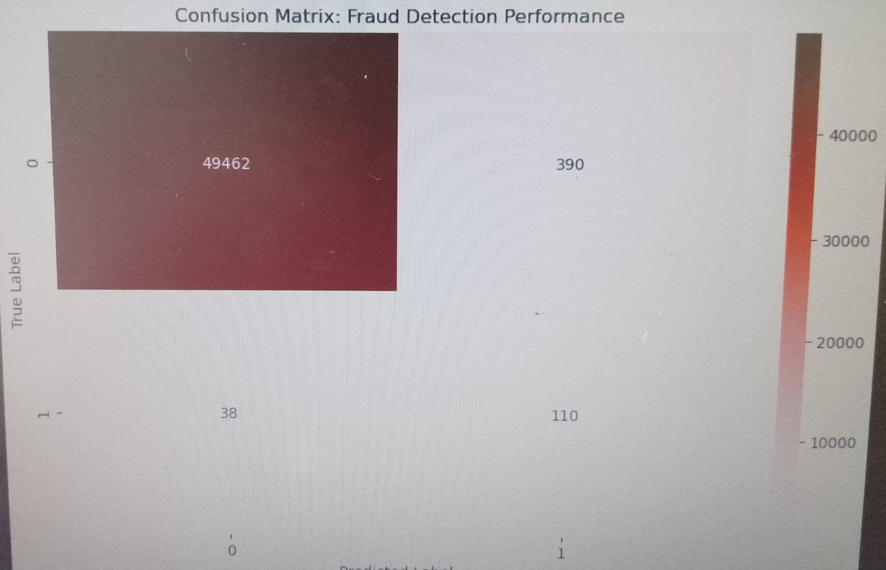

# Credit Card Fraud Detection System
### *Unsupervised Machine Learning for Financial Security*

## 📌 Project Overview
This project implements an automated fraud detection system using the **Isolation Forest** algorithm. It identifies anomalies in transaction data without requiring pre-labeled historical data, making it highly adaptable to new fraud patterns.

## 🚀 Key Features
* **Secure Authentication:** Integrated a login gateway using Python's `getpass` module.
* **Anomaly Detection:** Uses Isolation Forest to isolate outliers in transaction data.
* **Data Scaling:** Implemented `StandardScaler` to normalize transaction amounts.
* **Interactive Visuals:** Provides a professional **Confusion Matrix** heatmap for evaluation.

## 🛠️ Technical Stack
* **Language:** Python
* **Data Handling:** Pandas, NumPy
* **Machine Learning:** Scikit-learn
* **Visualization:** Seaborn, Matplotlib

## 📊 Results & Performance

During testing with the Credit Card Fraud dataset:
* **Accuracy:** ~99%
* **Fraud Identification:** Successfully isolated fraudulent cases from a highly imbalanced dataset.

## 📝 How to Use
1. Open the `.ipynb` file in VS Code.
2. Run the cells and enter the credentials:
    * **Username:** Aster
    * **Password:** 2026

## 🎓 Academic Significance
This project demonstrates expertise in handling Big Data, implementing unsupervised algorithms, and data visualization for Cybersecurity applications.

